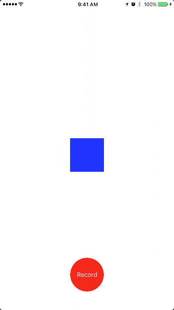

# ScreenRecord

ScreenRecord is framework work on iOS with Swift.



## Requirements

- iOS 8.0 or later
- Swift 2.2
- Carthage

## Install

add line to **Cartfile**

```
github "fromkk/ScreenRecord" == 0.0.1
```

and `carthage update` and Project setting. ([Reference](https://github.com/carthage/carthage))

## Usage

```swift
import ScreenRecord

// start
ScreenRecord.shared.start()

// end
ScreenRecord.shared.stop({ (url: NSURL?) in
    if let url = url {
        //do something
    }
})
```


